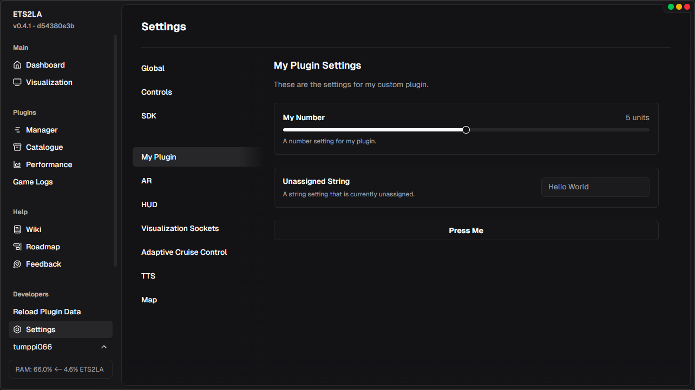

ETS2LA has a built in custom UI framework. It functions much like NextJS and it's SSR (Server Side Rendering). This means that you create components, that get rendered by the backend, and then sent over to the frontend to be displayed. This has some limitations, but it provides a very fast and flexible way for developers to create UI, you can use any CSS you wish!

### How do I create a page?
Most plugins will want to create a settings page so we will go over that example here. Please do note that you can create any page you want, not just settings pages. This page will act as the UI for the settings created earlier in the [Settings](./Settings) documentation.

We can start off by importing the necessary components from the UI framework and our settings class.
```python
from ETS2LA.UI import (
    ETS2LAPage,
    ETS2LAPageLocation,
    styles,
    Text,
    Button,
    TitleAndDescription,
    SliderWithTitleDescription,
    InputWithTitleDescription
)

from CataloguePlugins.MyPlugin.settings import Settings
settings = Settings()
```
Next we can create our page class. Similar to the settings, we will inherit from `ETS2LAPage` and then set the location to `ETS2LAPageLocation.SETTINGS`. You can check the definition of `ETS2LAPageLocation` to see what other locations are available.
```python
class SettingsMenu(ETS2LAPage):
    url = "/settings/myplugin"
    location = ETS2LAPageLocation.SETTINGS
    title = "My Plugin" # this is shown as the text in the button to open this page
    refresh_rate = -1 # means only on *action*, set to a positive number to refresh every n seconds

    def render(self):
        ...
```
Since we're interacting with our settings, we need to create helper functions to handle getting the values. **Our UI components do not support lambda!** You need to create proper functions for getting and setting values, or any other actions you want to perform.
```python
    def handle_my_number_change(self, value: float):
        settings.my_number = value

    def handle_unassigned_string_change(self, value: str):
        settings.unassigned_string = value

    def handle_some_button(self):
        print("Button pressed!")
```
ETS2LA itself doesn't have a prebuilt component for lists, but nothing is stopping you from creating your own! For this example we will ignore the list setting we defined earlier. Just think of it as an internal setting that you wouldn't want the user to change.

We are finally ready to actually define how the page looks. This is done inside the `render` function. This function should not return anything, as the rendering itself is done in the backend. Just call the components you want to use as normal functions.
```python
    def render(self):
        TitleAndDescription(
            "My Plugin Settings",
            "These are the settings for my custom plugin.",
        )
        SliderWithTitleDescription(
            title="My Number",
            description="A number setting for my plugin.",
            suffix=" units",
            min=0,
            default=settings.my_number,
            max=10,
            step=1,
            changed=self.handle_my_number_change,
        )
        InputWithTitleDescription(
            title="Unassigned String",
            description="A string setting that is currently unassigned.",
            default=settings.unassigned_string or "",
            changed=self.handle_unassigned_string_change,
        )
        with Button(action=self.handle_some_button):
            Text("Press Me", styles.Classname("font-bold"))
```
There's one more thing to do, and that is to register this page so that ETS2LA knows about it. This can be done by adding the following line to your `ETS2LAPlugin` definition.
```python
    pages = [
        SettingsMenu,
    ]
```
Once that's done and you restart ETS2LA / let your plugin reload, you should see your new settings page appear in the settings menu! There's obviously a lot more you can do with the UI framework (check the HUD pages for more examples), but this should cover the basics. 
<br/>

<br/>
:::tip
You might be wondering *why the long component names*? <br/>
This is to avoid any naming conflicts with the actual root components. Those long named imports are just wrappers made by the ETS2LA team to make it easier to create pages. You can usually CTRL+Click them in your IDE to see how they are made up.
:::