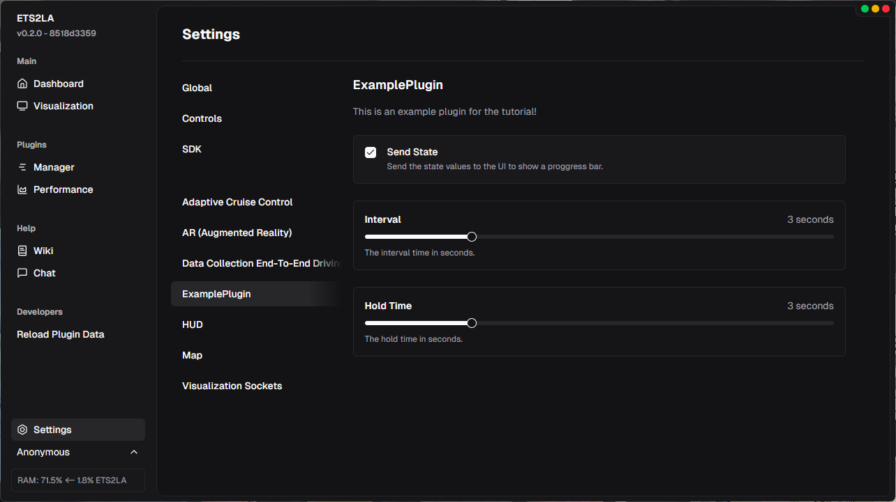
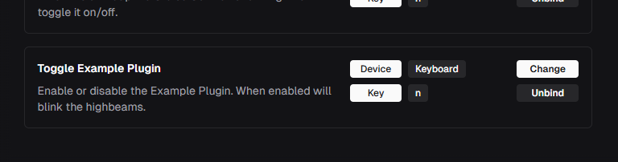

# Creating Your First Plugin

This is actually really easy! The entire framework has been made to make the initial setup as painless as possible. We should get you up and running in around 15 - 30 minutes!  

:::warning
Before we begin, make sure that you've gone through [Setting up a Development Environment](Setting%20up%20a%20Development%20Environment.md) or otherwise the following will be extremely tedious!
:::

:::danger
This page is out of date! Please refer to the **Plugin Framework** category for up to date information. You can use this as a reference but please pay attention to the following changes:
- Settings handling has been changed. You should create a `Settings` instance for your plugin and use that instead of `self.settings`.
- Events have been changed. You can now create, listen to, and handle events using the `Event` class.
:::

### 1. Creating the initial `main.py` file for your Plugin.

Firstly you will need to name your Plugin. Let's say that in this example I am just going to name it `ExamplePlugin`. Once you've got a name you can create the `CataloguePlugins/ExamplePlugin/main.py` file, this will be the main entrypoint for your Plugin.

:::warning
To avoid problems later, please use the `CataloguePlugins` directory for development. If you intend to publish your plugin to the catalogue later, it will be installed here!
:::

### 2. Creating the initial `ETS2LAPlugin` class.

ETS2LA is based on the **Python class** system. You will create your own class that will inherit from `ETS2LAPlugin` and this will give it access to the ETS2LA backend. This means that if we update the backend, **all plugins will receive the updates**. Most of the time a backend update will not require any input from plugin developers.

Below I've written the bare minimum plugin class, and we will go through what each step means as we go further along.  

:::tip
Having an **init()** function is actually not necessary, but having a **description, author** and **run()**  
function is! The plugin will refuse to load without them all!
:::

```python
from ETS2LA.Plugin import *

# The plugin class needs to be named Plugin!
class Plugin(ETS2LAPlugin):
    # You can hover over the PluginDescription in your code editor
    # to see all the available variables.
    description = PluginDescription(
        name="ExamplePlugin",
        version="1.0.0",
        description="An example plugin for ETS2LA.",
        fps_cap = 20 # By default the cap is 30fps, it is recommended
                     # to lower the FPS cap if your plugin allows!
    )
    
    # Author should be an array of Author objects.
    # It's named author instead of authors for backwards
    # compatibility.
    author = [
        Author(
            name="Tumppi066",
            url="https://tumppi066.fi"
        )
    ]
    
    # DO NOT USE __init__!
    # (if you absolutely must the remember to call super().__init__())
    
    # Use the init() function instead as that
    # is ran after the backend initialization.
    def init(self):
        ...
        
    # The run() function will be called for each "frame".
    # REMEMBER: All functions in a class need the self argument!
    def run(self):
        ...
```

And that's it! We are done! After you start ETS2LA again (or click the _Reload Plugin Data_ button on the sidebar) you should see your plugin in the manager. _Please remember to clear the filters!_ Right now it won't do anything, but we'll fix that next!

### 3. Implementing some functionality.

So I have a vision for this plugin. I want to flash the highbeams in ETS2, but I want some additional functionality like a settings page for changing the frequency and hold time, a slider on the frontend to show the progress, as well as a keybind in the settings to make enabling and disabling easy.

We should probably start with the actual functionality of blinking the lights. [SDKController](../Modules/SDKController.md) is what we use to send controls to the game. And by looking at that page we can see a `hblight` variable. That's probably what we need! I guess we should import the module and see what it does.  

:::warning
The games are weird when it comes to control output. You often have to experiment with how the game handles some controls to find the right way to use them. Also remember that the game will refuse any input when it's not focused!
:::

```python
...

description = PluginDescription(
    name="ExamplePlugin",
    version="1.0.0",
    description="An example plugin for ETS2LA.",
    modules=["SDKController"] # < Added the module to the modules list
)

hold_time = 1 # hold for 1s
interval = 1 # wait 1s for the next hold

...

# Next according to the instructions we get the controller object
def init(self):
    self.controller = self.modules.SDKController.SCSController()

def run(self):
    time.sleep(self.interval)
    # And we can then use it according to the page
    self.controller.light = True
    time.sleep(1/20)
    self.controller.light = False

    time.sleep(self.hold_time)
    
    self.controller.light = True
  time.sleep(1/20)
    self.controller.light = False
```

Seems to work! I guess we can now move on to some of the more advanced features.  
If you are following along keep in mind that:
- The length of the wait time between keypresses `1/20` needs to be changed based on the framerate, as the game only listens to inputs between the frames.
- The highbeams only work when the normal lights are enabled.

### 4. Interaction with the frontend.

There are some advanced features included in ETS2LA, but for this project we only need some of the simple ones. If you've already looked at the `ETS2LAPlugin` class then you might've noticed the `state` parameter. That is used to send a general persistent state to the frontend. We can use it for our timer!

It's quite self explanatory so let me just write the code here and we will see what it does.

```python
def run(self):
    interval_end = time.time() + self.interval
    while time.time() < interval_end: # wait until the interval is over
        percentage = 1 - ((interval_end - time.time()) / self.interval)
        self.state.text = "Waiting for lights..."
        self.state.progress = percentage
        time.sleep(0.1) # run at 10fps
            
    # And we can then use it according to the page
    self.controller.hblight = True
    time.sleep(1/20)
    self.controller.hblight = False

    hold_end = time.time() + self.hold_time
    while time.time() < hold_end: # wait until the hold time is over
        percentage = 1 - ((hold_end - time.time()) / self.hold_time)
        self.state.text = "Holding lights..."
        self.state.progress = percentage
        time.sleep(0.1) # run at 10fps
        
    self.controller.hblight = True
    time.sleep(1/20)
    self.controller.hblight = False
```

Seems to work! Keep in mind that I had to up the interval time to 3 seconds since the frontend only updates the states at 1fps.

Also let's be honest, this is quite a useless feature. So when we add the settings menu why don't we add a toggle for this too!

### 5. Handling a settings menu.

This has been made as easy as possible for developers too! We can define settings menus in pure python with no need to touch any typescript or website code. The one we're going to build is going to be extremely simple, but you can do quite advanced stuff with them. Everything except the Visualization page is actually done in python! You can check the /pages directory for examples (remember that plugin pages are _slightly_ different).

We have two options, either we define the settings in the same file as the plugin, or we make a new one. For the purposes of this tutorial I will define them in the same file, but if you decide to for example make a `ui.py` file, then remember that the `PluginDescription` has a `ui_filename` variable`ui_filename='ui.py'` for automatically listening to changes on that file too.

```python
from ETS2LA.UI import *
from ETS2LA.Utils import settings

class SettingsMenu(ETS2LAPage):
    # set a URL for your settings page
    url = "/settings/example_plugin"
    # this title will be the button text
    title = "Example Plugin"
    # and we want this page to show up in the settings
    location = ETS2LAPageLocation.SETTINGS

    # You need to handle the actions yourself.
    def handle_state_change(self, *args):
        if args: # If an arg is included the user clicked the checkbox
            value = args[0]
        else: # If it's not included the user clicked the container
            value = not settings.Get("ExamplePlugin", "state", True)
        settings.Set("ExamplePlugin", "state", value)
    
    def handle_interval_change(self, value):
        settings.Set("ExamplePlugin", "interval", value)

    def handle_hold_time_change(self, value):
        settings.Set("ExamplePlugin", "hold_time", value)

    def render(self):
        # This is a standard component for making your page
        # look like the rest
        TitleAndDescription(
            title="ExamplePlugin",
            description="This is an example plugin for the tutorial!"
        )
        
        # This is another premade component. You can see
        # all the different premade components and the raw items
        # they were made from in the definition.
        CheckboxWithTitleDescription(
            title="Send State",
            description="Send the state values to the UI to show a proggress bar.",
            # Default is the value currently shown
            default=settings.Get("ExamplePlugin", "state", True),
            # Changed is what gets called when something happens
            changed=self.handle_state_change
        )
        
        SliderWithTitleDescription(
            title="Interval",
            description="The interval time in seconds.",
            suffix=" seconds",
            # for sliders default is the value that is shown before the user
            # changes the value.
            default=settings.Get("ExamplePlugin", "interval", 1),
            min=1,
            max=10,
            step=1,
            changed=self.handle_interval_change,
        )

        SliderWithTitleDescription(
            title="Hold Time",
            description="The hold time in seconds.",
            suffix=" seconds",
            default=settings.Get("ExamplePlugin", "hold_time", 1),
            min=1,
            max=10,
            step=1,
            changed=self.handle_hold_time_change,
        )

class Plugin(ETS2LAPlugin):
    ...
    # You need to explicitly tell the plugin
    # which UI to use!
    pages = [SettingsMenu]
```



Looks nice doesn't it! And the best thing is we're already done with the UI part. It will automatically send the relevant events over to the backend when they happen, so you don't have to do any communication logic yourself. There's one more step though, and that is to implement the settings themselves.  

:::danger[REMEMBER!]
Always handle `None` values when getting stuff from the settings! This will avoid issues with your code downstream from the settings code!
:::

```python
def run(self):
    hold_time = self.settings.hold_time
    interval_time = self.settings.interval
    use_state = self.settings.state
        
    # You need to manually handle the case where settings are
    # not yet initialized!
    if hold_time is None: 
        hold_time = self.hold_time
        self.settings.hold_time = hold_time
            
    if interval_time is None: 
        interval_time = self.interval
        self.settings.interval = interval_time

    if use_state is None: 
        use_state = True
        self.settings.state = use_state

    interval_end = time.time() + interval_time
    while time.time() < interval_end: # wait until the interval is over
        percentage = 1 - ((interval_end - time.time()) / interval_time)
        if use_state:
            self.state.text = "Waiting for lights..."
            self.state.progress = percentage
        time.sleep(0.1) # run at 10fps
            
    # And we can then use it according to the page
    self.controller.hblight = True
    time.sleep(1/20)
    self.controller.hblight = False

    hold_end = time.time() + hold_time
    while time.time() < hold_end: # wait until the hold time is over
        percentage = 1 - ((hold_end - time.time()) / hold_time)
        if use_state:
            self.state.text = "Holding lights..."
            self.state.progress = percentage
        time.sleep(0.1) # run at 10fps
        
    self.controller.hblight = True
    time.sleep(1/20)
    self.controller.hblight = False
```

That should do it. When handling settings you have to remember to handle the case where nothing has referenced them yet, otherwise you will have a `None` value. In a larger plugin that handling should be done in another function for cleaner code, but we can just ignore that small issue for now.

:::tip
The reason we use `self.settings` inside the plugin code is because it's much less prone to race conditions, and causes less reads and writes. You can also do this inside of your pages with `self.plugin.settings`, but you have to remember to first check `if self.plugin:` to check if it's currently enabled!
:::

### 6. Handling keyboard and controller input.

There is one more thing I wanted to add. And that is getting user input. Like everything else this has been made extremely easy for developers. Once again I'll let the code do the talking!  

:::tip
Sometimes especially the keyboard input becomes a bit buggy due to how ETS2 handles it's input handler. On some PCs ETS2LA might just refuse to get any input from the keyboard if the game is open. This doesn't happen with Controllers.
:::

```python
from ETS2LA.Controls import *
from ETS2LA.Events import *

...

# Create a control event to enable or disable the plugin
enable_disable = ControlEvent(
    alias="enable_disable_example_plugin",
    name="Toggle Example Plugin",
    type="button",
    description="Enable or disable the Example Plugin. When enabled will blink the highbeams.",
    default="n" # only works with keyboard keys
)

def Plugin(ETS2LAPlugin):
    ...

    # Controls have to be explicitly added as well!
    controls = [
        enable_disable
    ]

    enabled = False # by default blinking is disabled

    @events.on("enable_disable_example_plugin")
    def handle_event(self, value: bool):
        if value == False:
            return # button up event
        self.enabled = not self.enabled

    def run(self):
        if not self.enabled:
            self.state.reset() # remember to reset the state!
            return # If we return here the plugin will cap it's fps
        
        # You could also access the button value directly
        # enable_disable.pressed()
```



Just like that we have our own entry in the Controls menu! I'm not going to spend bandwidth sending another video of this but just trust me in that everything works as it should.

### Some final words.

We've made a very simple plugin, but I hope this indicates how building plugins for ETS2LA might not be as daunting as you might've thought! There are a lot of other tutorials in these pages so you can go look at them for additional features, the entire application is also a living documentation page. Just go look at the code for a plugin you are interested in and learn from it!

If you are missing something or would've liked more information about some section then you can ping me on discord and I'll try and improve the page. With that said the final plugin files are available on https://github.com/ETS2LA/example-plugin so you can take a look at them yourself.

Also remember to check [Plugin Catalogue](../Plugins%20%281%29/Plugin%20Catalogue.md) for how to get your plugin out to the users!

**I hope this helped you, and I hope we can see you again in the future ❤️**